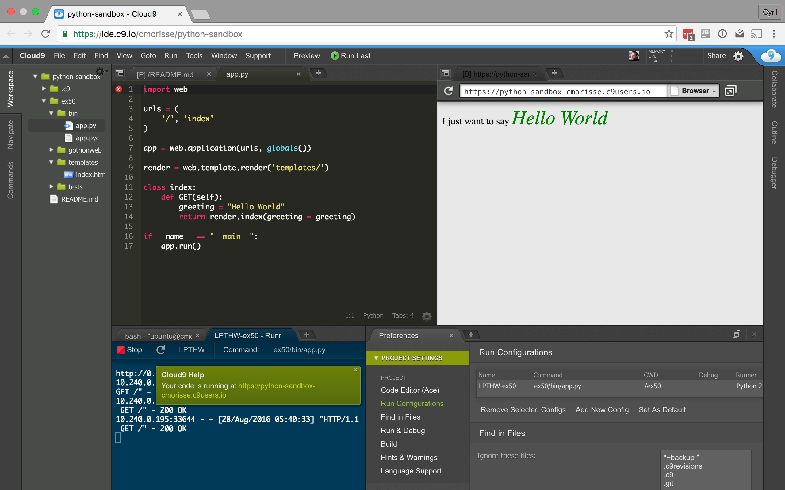
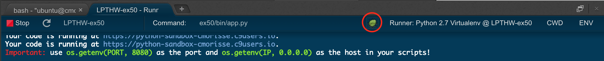
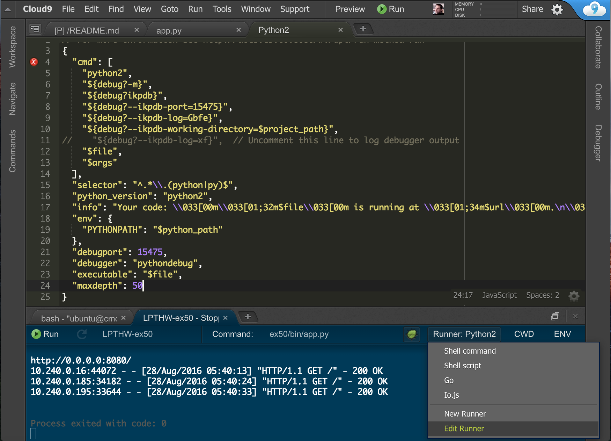

IKPdb User Guide for Cloud9
===========================

This document gives some *"Python"* and *"IKPdb"* specific information which 
supplement the :ref:`getting-started-with-cloud9` paragraph and 
the `Cloud9 debugging documentation <https://docs.c9.io/docs/debugging-your-code>`_

Cloud9 concepts relative to code execution
------------------------------------------

This paragraph introduce the notions of **"Run configurations"** and **"Runners"**.

Cloud9, execute your code using “Run configurations” that reference “Runners”.

"Run configurations" describe what you want to run, the associated command line 
parameters and the current working directory (CWD).
*"Run configuration"* are available via the **Run / Run configuration** menu entry.

"Runners" describe the runtime you want to use (for python the runtime is the 
interpreter).
"Runners" are available via the **Run / Run with** menu entry.

In figure 1 below, Cloud9 runs *ex50/bin/app.py* from the "ex50" folder via 
a run configuration named "LPTHW-ex50" which uses the Runner "Python 2".

Debugger information is defined in the *Runner* and debugging is activated 
in the *"Run configuration"* by clicking on the green bug button as shown on
figure 2.

**Figure 1:**

**Figure 2:**

IKPdb Installation
------------------

IKPdb may not be installed in your workspace.

Check wether it is with the command:

.. code-block:: bash

   $ python -m ikpdb --help

If you get an error message, ikpdb is not installed. Install it with:

.. code-block:: bash

   $ sudo pip install ikpdb

Virtualenv's support
____________________

If you created a virtualenv, you defined a new interpreter. So you must install 
IKPdb inside the virtualenv and create a new *"Runner"* that points to the 
virtualenv's python interpreter as described in this paragraph.

SSH Workspace support
_____________________

IKPdb listens for commands on port 15471 and this network port is specified 
in the Python runner.

If you run several "Cloud9 SSH Workspace" you must create a Runner per 
workspace to allocate each runner a dedicated debugger port and avoid network 
port collisions.

Cloud9 "Runner" creation
------------------------

You can create a runner from scratch or modify an existing. Only the later is 
described here.

To create a runner using an existing one as a template:

* On the Run panel, select the runner you want to use as template
* Clic on the runner name.
* A list of all runners appears. Go to the bottom of the list and clic on "Edit runner". You can see the runner list and the "Edit runner" menu entry on *Figure 3* below.

The runner you selected is now opened in an editor as shown on *Figure 3*.

**Figure 3: Runner creation**

Here you can modify:

* *Line 5* with the full path of you python interpreter, if you use virtualenv.
* *Line 8 and 21* if you need to modify IKPdb's network port.

Source files mapping
____________________

On Cloud9, IKPd working directory is set to Cloud9 workspace folder.
If you create Custom runner don't forget to do the same.

See :ref:`source-files-mapping` for more information on this subject.

Debugger usage instructions
---------------------------

This is covered by Cloud9 documentation in the  `Cloud9 debugging documentation <https://docs.c9.io/docs/debugging-your-code>`_.

Please note that IKPdb supports this (beyond the basics) features list:

* Conditional breakpoints
* Hot modification of variables
* Execution of arbitrary python code via the Immediate Panel
* Evalution of "Watch expressions"
* "Turbo" mode

.. _turbo-mode:

"Turbo" mode
------------

Turbo mode idea is that as soon there is no active breakpoints, IKPdb turns
off tracing in all threads. The program then runs at python's speed.

Tracing is reenabled when:

* user sets a breakpoint
* user suspends execution
* a non managed exception occurs in the debugged program
* a managed exception occurs in a debugged program's exception manager which explicitly launchs IKPdb (see: **TODO: IKPdb integration**)

IKPdb exchanges file names with his client. When it sends a file name, IKPdb always uses full path.
