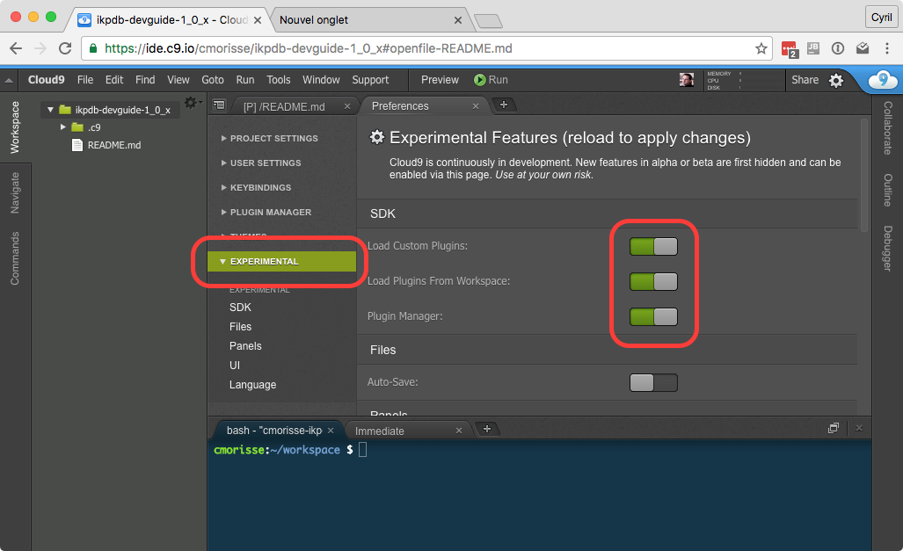
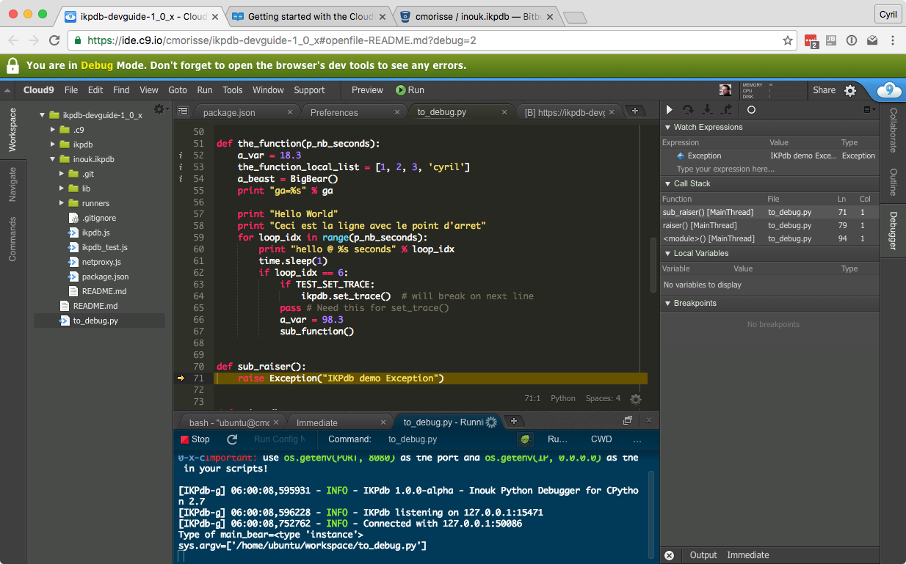

IKPdb Developer's Guide
========================

This document describes how to modify the debugger (IKPdb) or the Cloud9 client
(IKPdb plugin).

IKPdb is developed on Cloud9, so this guide covers the development process on Cloud9.
You can use a "Free" Cloud9 account to hack on IKPdb.

If you plan to work on IKPdb's Cloud9 client plugin, you should read the 
`Cloud9 SDK Documentation <https://cloud9-sdk.readme.io/docs>`_.

Development environment Setup
-----------------------------

Use these commands in the terminal of your workspace to install required 
dependencies:

.. code-block:: bash

    $ sudo apt-get update
    $ sudo apt-get install -y python-dev

Create a workspace
__________________

Create a new Cloud9 Workspace using the Blank (Ubuntu) template. 
Choose whatever name you want, but il you plan to share your workspce, you 
should choose an explicit name (eg. ikpdb-dev-1_0_X).

.. _install-ikpdb-source-code:

Install IKPdb's source code
___________________________

Use these commands in the terminal of your workspace to download IKPdb's source 
code and install it in pip "editable" mode (in "editable" mode, modifications 
you made are effective each time you relaunch IKPdb.

Don't forget to replace *1.0.x* below by the branch you want to work on.

.. code-block:: bash

    $ git clone https://github.com/cmorisse/ikpdb.git
    $ cd ikpdb
    $ git checkout 1.0.x  # Select a branch
    $ sudo pip install --upgrade -e .
   
Check installation is correct by trying to import ikpdb and printing it's 
version:

.. code-block:: bash

    $ python
    Python 2.7.6 (default, Jun 22 2015, 17:58:13) 
    [GCC 4.8.2] on linux2
    Type "help", "copyright", "credits" or "license" for more information.
    >>> import ikpdb ; ikpdb.__version__
    '1.0.0-alpha'
    >>>exit()
    $

Copy IPdb's python test file "to_debug.py" in your workspace root.

.. code-block:: bash

    $ cd  ~/workspace
    $ cp ikpdb/tests/to_debug.py .

Now, you must have a to_debug.py file at the root of your workspace.
*to_debug.py* allows to test all debugger's features.

Activate the Cloud9 Plugin Manager
__________________________________

Open the *"Preferences"* panel using the "Cloud9 / Preferences" menu item.
Open the "EXPERIMENTAL" tab and activate the 3 options in the "SDK" group 
as shown on next picture:

* Load Custom Plugins
* Load Plugin From Workspace
* Plugin Manager

Then reload Cloud9 using the navigator "Refresh Page" command.

When it's done and after you refreshed the page, you must see a "PLUGIN MANAGER"
tab in the "Preferences" panel.

Restart Cloud9 in developer mode
--------------------------------

Use the "Tools / Developer / Start in Debug Mode" menu entry to restart Cloud9 
in Developer Mode.

Now, you must have a green banner saying: "You are in Debug Mode."

**Important note: You must always be in developer mode to make Cloud9 use the 
plugin you are developing and not the bundled one !**

Install the Cloud9 Plugin
-------------------------

Download source code
____________________

Enter these commands in the terminal of your workspace to download IKPdb's 
Cloud9 plugin source code:

.. code-block:: bash

    $ cd ~/workspace
    $ git clone https://github.com/cmorisse/c9.ide.run.debug.ikpdb.git

Now, you must have a *c9.ide.run.debug.ikpdb* folder at the root of your 
workspace.

Open the *'c9.ide.run.debug.ikpdb/package.json'* file and modify "version" 
with a unique value. This will help you to check whether Cloud9 is running 
your version of the plugin.

Activate the plugin
___________________

Enter these commands in the terminal to make Cloud9 load **your** plugin
version:

.. code-block:: bash

    $ cd ~/workspace
    $ mkdir -p ~/.c9/plugins
    $ ln -s /home/ubuntu/workspace/c9.ide.run.debug.ikpdb  ~/.c9/plugins

Now, you must have a *'~/.c9/plugins/c9.ide.run.debug.ikpdb'* link to 
*'~/workspace/c9.ide.run.debug.ikpdb'*. 

Refresh your page to reload Cloud9 and use the *PLUGIN MANAGER* to verify that 
**your** version of the plugin is installed and running.

Test the plugin and the debugger
--------------------------------

Using instruction in the :doc:`IKPdb User Guide for Cloud9 <cloud9_user_guide>`,
run to_debug.py with the "Python 2.7 IKPdb.run" runner.

Your should get something like that:

You can now modify either the debugger or the plugin and see the result.

*Don't forget to reload Cloud9 (by Refreshing your page) when you modify the 
plugin.*

