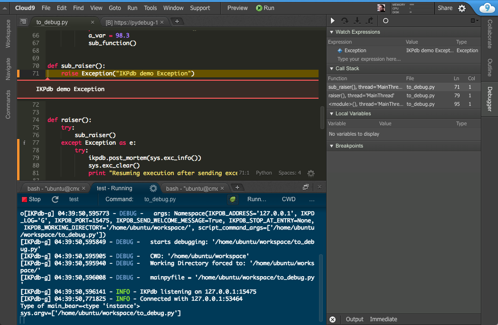

.. IKPdb documentation master file, created by
   sphinx-quickstart on Tue Aug 23 04:27:18 2016.
   You can adapt this file completely to your liking, but it should at least
   contain the root `toctree` directive.

.. _IKPdbGitHub: https://github.com/audaxis/ikpdb
.. _IKPdbCloud9PluginGitHub: https://github.com/audaxis/c9.ide.run.debug.ikpdb
.. _Cloud9GitHub: https://github.com/c9/core

Welcome to IKPdb's documentation!
=================================

A hackable CPython remote debugger designed for the Web.

Features
--------

IKPdb supports:

* Debugging of multithreaded programs
* Conditional breakpoints
* Variables hot modifications
* :ref:`turbo-mode`

IKPdb has no integrated GUI ; its only interface is a TCP protocol.

**IKPdb client GUI reference implementation is** `Cloud9 Online IDE <https://c9.io/?redirect=0>`_

IKPdb TCP protocol - based on JSON - is designed for easy integration with latest
generation of Javascript editor / IDE (eg. Visual Studio Code, Cloud9, Atom).

Please note that IKPdb supports only CPython 2.7, CPython 3 support is the next 
step.

Getting started
---------------

.. _getting-started-with-cloud9:

Getting started with Cloud9
___________________________

1. Create a Workspace using the Python template

2. Install the debugger 

.. code-block:: bash

   $ pip install ikpdb

3. Create a new file with a few statements and save it as "debug_me.py".

You can copy / paste this snippet.

.. code-block:: python

   #coding: utf-8
   print "I want to try Python debugging with IKPdb in Cloud9."
   print "I step over onto this line."

4. Set a breakpoint on the first line by clicking in the left margin until a 
red circle appears.

**Ignore the red check button on line 1 ; as it is relevant only for Django development.**

.. image:: index_pic1__py_snippet.png

5. Click on the Run button at the Top menu right-hand side.

.. image:: index_pic2__run_button.png

The debugger is now open on the breakpoint you defined at step 3.

.. image:: index_pic3__debugger_opened.png

Now you can:

* Play with the debugger
* Read the `Cloud9 debugging documentation <https://docs.c9.io/docs/debugging-your-code>`_ to discover all Cloud9 features related to debugging.
* Read :doc:`IKPdb User Guide for Cloud9 <cloud9_user_guide>` to get information about IKPdb and Python debugging.

.. _getting-started-without-cloud9:

Getting started without Cloud9
______________________________

IKPdb is a debug server. You need a client to use it.
You can use Cloud9 client (see above) or develop your own.

For that, follow the instructions in :ref:`install-ikpdb-source-code` 
to install IKPdb from source code.

Now you can launch IKPdb.

IKPdb has a --help command that shows all available options.

.. code-block:: bash

   $ python -m ikpdb --help

Start a debugging session with:

.. code-block:: bash

   $ python -m ikpdb to_debug.py
   [IKPdb-g] 05:04:40,690467 - INFO - IKPdb 1.0.0 - Inouk Python Debugger for CPython 2.7
   [IKPdb-g] 05:04:40,690937 - INFO - IKPdb listening on 127.0.0.1:15470
   
This command starts debugging of the *to_debug.py* python file.
IKPdb is then listening for commands on localhost port 15470 (15470 is default port).

Now you can start hacking on your own client. For that you can use this starting material:

* :doc:`developers_guide`
* :doc:`protocol`
* `IKPdb Cloud9 client source code <https://github.com/audaxis/c9.ide.run.debug.ikpdb>`_
* `IKPdb source code <https://github.com/audaxis/ikpdb>`_

.. _source-files-mapping:

Source files mapping
--------------------

IKPdb exchanges file names with his debugger clients. When it sends a file name, IKPdb 
always uses full path. But some debuggers client sends relative paths 
(when setting breakpoints for example). In that case, IKPdb tries to resolve the
file's full path using its *"working directory"* as a base folder. If it fails, 
IKPdb sends a "FileMappingError:".

IKPdb's working directory can be defined:

* Implicitly ; working directory is set to the debugged program's current directory.
* Explictly ; using the **--ikpdb-working-directory** command line parameter

To ask IKPdb to display its working directory add a **--ikpdb-log=G** command 
line parameter in the runner.

User's Guide
------------

You'll find more information about IKPdb usage in the 
:doc:`cloud9_user_guide`.
This guide covers the debugger and the Cloud9 client plugin.

Integration's Guide
-------------------

You can get a huge productivity boost by integrating IKPdb with the software 
of the framework you use. Once integrated, the debugger will automaticaly opens
an gives you all information required to debug each time an exception occurs.

Read the :doc:`integration_guide` here.

Developer's Guide
-----------------

The :doc:`developers_guide` describes how to modify the debugger or the 
IKPdb's client Cloud9 plugin.

Documentation Writer's Guide
----------------------------

The documentation is written using the `Sphinx Documentation Generator <http://www.sphinx-doc.org/>`_

The :doc:`doc_writers_guide` describes how to enhance the documentation 
you are reading.

Source code
-----------

IKPdb is composed of these projects hosted on github:

* `IKPdb debugger <https://github.com/audaxis/ikpdb>`_
* `IKPdb Cloud9 reference client <https://github.com/audaxis/c9.ide.run.debug.ikpdb>`_

Protocol description
--------------------

You'll find a high level overview of IKPdb's protocol in the 
:doc:`protocol` 

API
---

Find the complete documentation of IKPDb's debugger source code in the
:doc:`api` document.

Dependencies
------------

IKPdb has no external dependencies (and we wish this to remain like that).

Issues / Suggestions
--------------------

Please feel free to file an issue on the project's Github bug tracker if you:

* have found a bug
* have some idea about improvements or optimizations
* have some needs to build a new debugging client !

License
-------

IKPdb is MIT licensed.
All detail in the :doc:`license` page.

Indices and tables
==================

* :ref:`genindex`
* :ref:`search`

